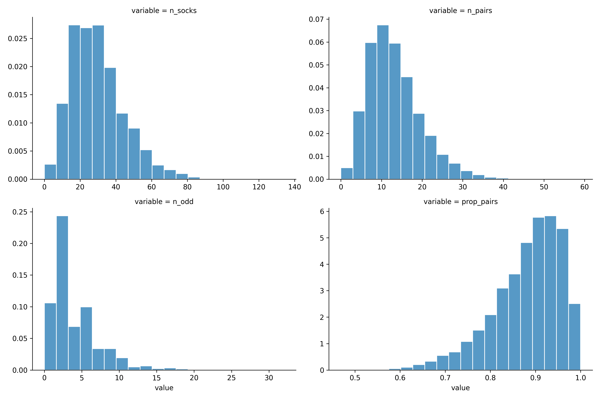
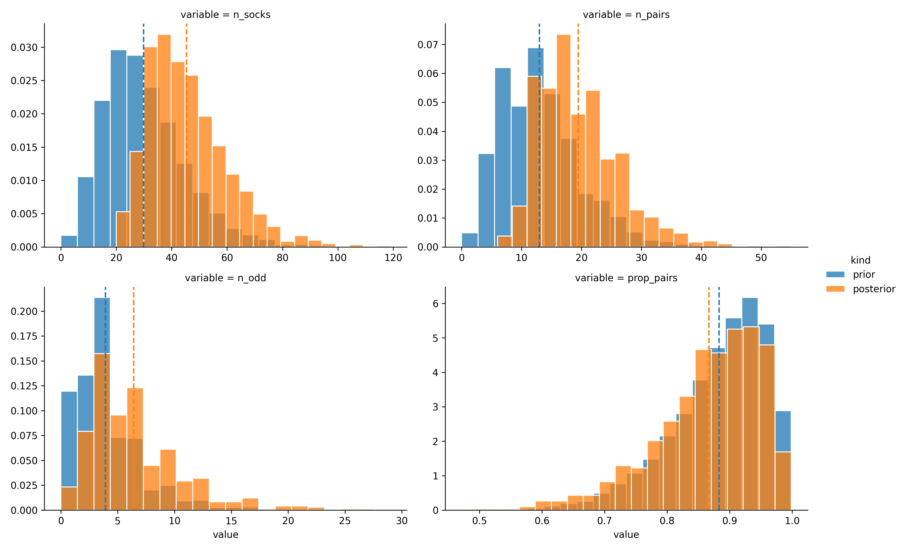

```{r setup, include=FALSE}
knitr::opts_chunk$set(echo = FALSE)
```

> This is a Python port of Rasmus Bååth's post on [Tiny Data, Approximate Bayesian Computation and the Socks of Karl Broman](http://www.sumsar.net/blog/2014/10/tiny-data-and-the-socks-of-karl-broman/), which originally had accompanying code in R. I encourage you to read his blogpost first, and use this blogpost as companion for Python code.

*Eleven socks*. It all started with eleven socks. The problem is stated as follows: [Karl Broman](https://twitter.com/kwbroman) picked his first eleven unique socks from his laundry. *Given the tiny dataset of eleven unique socks, how many socks does Karl Broman have in his laundry in total?* 

## Data Generating Process

Before we start, let's import python libraries.

```python
import numpy as np
import pandas as pd

# set seed for reproducibility
np.random.seed(12)
```

We start by building a generative model, a simulation of the I’m-picking-out-socks-from-my-laundry process. We have a couple of parameters assign to an arbitrary values:

```python
n_socks = 18
n_picked = 11
```

But, there are several socks that didn't come in pairs (aka singletons). So out of the `n_socks` let’s say we have:

```python
n_pairs = 7
n_odd = 4
```

We create an array of socks, represented as integers, where each pair/singleton is given a unique number.

```python
socks = np.repeat(range(n_pairs + n_odd), np.repeat([2, 1], [7, 4]))
socks

>> array([ 0,  0,  1,  1,  2,  2,  3,  3,  4,  4,  5,  5,  6,  6,  7,  8,  9, 10])
```

Finally we simulate picking out `n_picked` socks (or at least `n_socks` if `n_picked` > `n_socks`) and counting the number of sock pairs and unique socks. In Python, Pandas is really helpful to create a series of values and count the occurence of each values.

```python
picked_socks = np.random.choice(socks, size=min(n_picked, n_socks), replace=False)
socks_count = pd.Series(picked_socks).value_counts()
dict(pairs = sum(socks_count == 2), odd = sum(socks_count == 1))

>> {'pairs': 2, 'odd': 7}
```

As Bååth suggested, by figuring out the data generating process, we are almost done in tackling the problem.

## Building ABC algorithm

Bååth pointed out how we perform simple ABC rejection algorithm. In general, the algorithm works as follows:

* Construct a generative model that mimicked the data generating process. 
* Sample parameters values from the prior distributions and plug the parameters into the generative model and simulate a dataset.
* If the simulated dataset matches the actual data, add the parameter values to a list. if no, throw them away.
* Iterate step 2 and 3 for large number of times building up the list of probable parameter values.
* The distribution of the probable parameter values represents the posterior information regarding the parameters.

## Prior Sock Distributions

> we can’t afford to use non-informative priors [on this problem], that’s a luxury reserved for the Big Data crowd, we need to use all the information we have.

I can't agree more with Bååth. With our tiny data, we really need to make a reasonable prior and how we could incorporate our domain knowledge to the data we have. As he mentioned, before seeing any data, we know that `n_socks` must be positive (no anti-socks) and discrete (socks are not continuous). We choose the negative binomial distribution as prior. It's reasonable to guesstimate that you would have something like 15 pairs of socks (30 socks) in the laundry. So as a prior for `n_socks` I’m going to use a negative binomial with mean `prior_mu` = 30 and standard deviation `prior_sd` = 15. In Numpy, `negative_binomial` function is parameterized with the probability `p` and size `n`. But, we could transform from mean `mu` and deviation `sd` to `p` and `n` as follows:

```python
prior_prob = prior_mu / prior_sd**2
prior_size = prior_mu * prior_prob / (1 - prior_prob)

prior_mu = 30
prior_sd = 15
data_points = 1000

# number of socks model by negative binomial
n_socks = np.random.negative_binomial(n=prior_size, p=prior_prob, size=data_points)
```

We create a proportion of pairs `prop_pairs` distribution as a proxy for prior distribution on `n_pairs` and `n_odd`. On `prop_pairs`, we choose Beta prior distribution that puts most of the probability over the range 0.75 to 1.0. We also round the `n_pairs` and `n_odd` as socks are discrete entities.

```python
# proportion of pairs model by beta distribution
prop_pairs = np.random.beta(a=15, b=2, size=data_points)
n_pairs = np.round(np.floor(n_socks / 2) * prop_pairs)
n_odd = n_socks - n_pairs * 2
```

We create the prior distribution using Seaborn as our choice of data visualization tools.

```python
prior_plot = (
    pd.DataFrame(dict(n_socks=n_socks, prop_pairs=prop_pairs, n_pairs=n_pairs, n_odd=n_odd))
    .melt()
    .pipe((sns.FacetGrid, 'data'), col="variable", col_wrap=2, sharex=False,
        sharey=False, height=4, aspect=1.5)
    .map_dataframe(sns.histplot, "value", stat="density", edgecolor='white', bins=20)
    .add_legend()
)
prior_plot
```



## Socks Simulation

Now we have a generative model, with reasonable priors, let's push the "simulate" button by running the code from earlier steps together and generates 10,000 samples from the generative model.

```python
def simulate_socks(iter=10000):
    data = []

    # parameter for negative binomial prior distribution
    prior_mu, prior_sd = 30, 15
    prior_prob = prior_mu / prior_sd**2
    prior_size = prior_mu * prior_prob / (1 - prior_prob)

    # parameter for beta prior distribution
    a, b = 15, 2
    for _ in range(iter):
        # number of socks model by negative binomial
        n_socks = np.random.negative_binomial(n=prior_size, p=prior_prob)

        # proportion of pairs model by beta distribution
        prop_pairs = np.random.beta(a=a, b=b)
        n_pairs = int(np.round(np.floor(n_socks / 2) * prop_pairs))
        n_odd = n_socks - n_pairs * 2
  
        # simulate picking socks
        socks = np.repeat(range(n_pairs + n_odd), np.repeat([2, 1], [n_pairs, n_odd]))
        picked_socks = np.random.choice(socks, size=min(n_picked, n_socks), replace=False)
        socks_count = pd.Series(picked_socks).value_counts()

        sample = (sum(socks_count == 2), sum(socks_count == 1), n_socks, n_pairs, n_odd, prop_pairs)
        data.append(sample)
    return pd.DataFrame(data, columns=['pairs', 'unique', 'n_socks', 'n_pairs', 'n_odd', 'prop_pairs']) 

socks_sim = simulate_socks()
socks_sim.head()
```

|   pairs |   unique |   n_socks |   n_pairs |   n_odd |   prop_pairs |
|--------:|---------:|----------:|----------:|--------:|-------------:|
|       1 |        9 |        49 |        23 |       3 |         0.95 |
|       0 |       11 |        59 |        25 |       9 |         0.88 |
|       4 |        3 |        12 |         5 |       2 |         0.87 |
|       1 |        9 |        35 |        15 |       5 |         0.85 |
|       2 |        7 |        26 |        11 |       4 |         0.84 |

In order to turn our simulated samples `sock_sim` into posterior samples, conditioned on the data, we need to remove the simulated data that doesn’t match the actual data. The data we have is that out of eleven picked socks, eleven were unique and zero were matched, so let’s remove all simulated samples which does not match our data.

```python
post_samples = socks_sim.query("pairs == 0 & unique == 11")
```
And now you just performed approximate bayesian computation! After taking account the model and the data, we left with 1,183 remaining samples in `post_samples`, which represent the information we have about the number of socks in Karl Broman’s laundry. The following plot shows how the the prior sock distributions (blue) shifted into posterior sock distributions (orange) as we incorporate the data observed:

```python
def vertical_mean_line(x, **kwargs):
    plt.axvline(x.mean(), linestyle='--', color=kwargs.get("color", "g"))

posterior_plot = (
    # combine prior and posterior
    pd.concat([socks_sim.assign(kind='prior'), post_samples.assign(kind='posterior')])
    .drop(['pairs', 'unique'], axis=1)
    # tidy up
    .melt(id_vars='kind', value_vars=['n_socks', 'n_pairs', 'n_odd', 'prop_pairs'])
    # visualize
    .pipe((sns.FacetGrid, 'data'), col="variable", hue="kind", col_wrap=2,
           sharex=False, sharey=False, height=4, aspect=1.5)
    .map_dataframe(sns.histplot, "value", stat="density", edgecolor='white',
                   common_norm=False, bins=20)
    .add_legend()
    .map(vertical_mean_line, 'value') 
)
posterior_plot
```


And the median for each parameter on our `post_samples`:

```python
post_samples.median()
```

|   pairs |   unique |   n_socks |   n_pairs |   n_odd |   prop_pairs |
|--------:|---------:|----------:|----------:|--------:|-------------:|
|       0 |       11 |        44 |        19 |       6 |     0.882561 |

The vertical lines show the median posterior, a “best guess” for the respective parameter. There is a lot of uncertainty in the estimates but Karl Broman told that the actual number of pairs and odd socks is 21 pairs and 3 singleton, which summed to **45 socks**. Our "educated" guess using ABC algorithm only missed by 1 sock! 

To conclude, it's amazing how we could deduce almost perfectly the number of socks only with tiny data and a little bit of bayes ;)

#### Source Code

You access and run the full code using Google Colab or Deepnote [here](https://github.com/farhanreynaldo/side-project/blob/master/approximate-bayesian-computation.ipynb).

## Acknowledgments {.appendix}

This blogpost made possible entirely by Rasmus Bååth's post on [Tiny Data, Approximate Bayesian Computation and the Socks of Karl Broman](http://www.sumsar.net/blog/2014/10/tiny-data-and-the-socks-of-karl-broman/).